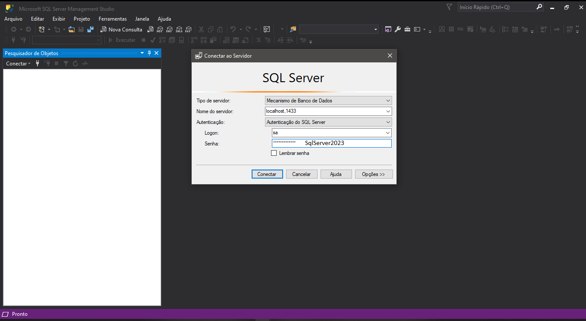
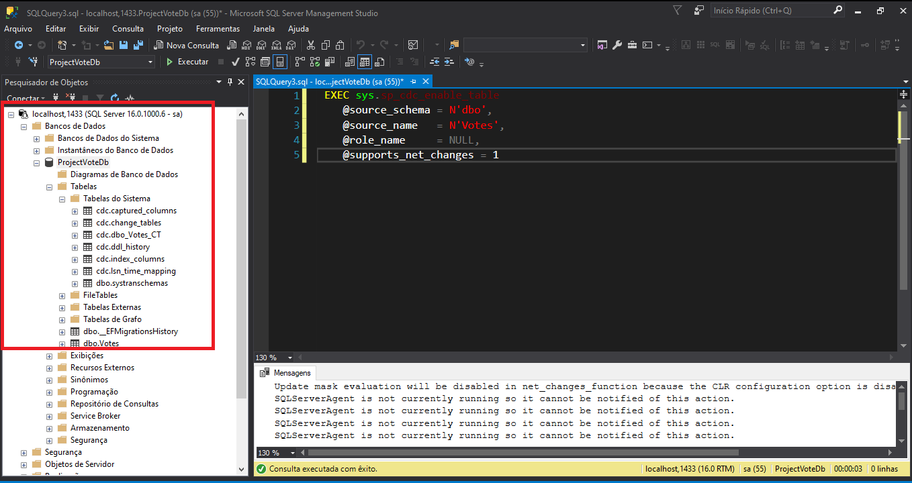

# POC.KakfaConnect - .Net 7 
## - EM DESENVOLVIMENTO

Este projeto é um estudo para se trabalhar com o KafkaConnect. Onde possui:
 - 1 Api de produtor de informações (Votos);
 - 1 Api de consumidor das informações geradas (Votos);
 - 1 Api KafkaConnect;
 - 1 Serviço Kafka;
 - 1 Serviço Zookeeper;
 - 1 Serviço Debezium rodando com KafkaConnect para enxergar alterações no Banco de Dados (necessita do CDC habilitado no banco de dados);
 - 1 Serviço SQL Server 2022;
 - Engine Docker;
 - WSL2.

 ## Como executá-lo
 ### Producer
Primeiro de tudo será necessário possuir a Engine Docker rodando em sua máquina. Para mais detalhes consulte: 

    https://github.com/codeedu/wsl2-docker-quickstart#integrar-docker-com-wsl-2

Efetuado a instalação do serviço de container em sua máquina. Abra um terminal, vá até a pasta `Producer` onde está o arquivo `Produce.sln` e execute o seguinte comando:

    docker build . -t producer-votes:latest

Este comando fará com que uma imagem da API produtora de dados seja criada e assim possível de ser executada no quando subirmos o docker compose.

### Consumer
Abra um terminal, vá até a pasta `Consumer` onde está localizado o arquivo `Votes.sln` e execute o seguinte comando:

    docker build . -t consumer-votes:latest

Este comando fará com que uma imagem da API consumidora de dados seja criada e assim possível de ser executada no quando subirmos o docker compose.

### KafkaConnect
Abra um terminal, vá até a pasta `Docker`e execute o seguinte comando:

    docker build . -t connect-sqlserver:latest

Este comando criará uma imagem que criará uma imagem do KafkaConnect com um plugin do Debézium para mais tarde, monitorar o banco de dados das alterações efetuada na tabela que configurarmos.

### docker compose:
Com os serviços configurados e as imagens criadas localmente, podemos então executar o docker compose. Ainda na pasta `Docker` e com o terminal aberto, execute o comando: 

    docker compose up -d

Este comando fará com que todos os serviços necessários entrem e execução. Este processo demora cerca de 1 a 2 minutos normalmente para estar concluido e todos os serviços comunicando entre si.

## Habilitando CDC no Banco de Dados SQL Server:

Como o objetivo aqui é somente demonstrar uma maneira de colocar o projeto em execução, não explicaremos o que seria o CDC, porém vou colocar um link de documentação para consulta, logo abaixo:

    https://learn.microsoft.com/pt-br/sql/relational-databases/track-changes/about-change-data-capture-sql-server?view=sql-server-ver16

Para habilitá-lo executaremos um passo a passo, desde a criação do banco de dados e da tabela:

- Abra o SQL Server Management Studio, e digite as credenciais que estão na imagem abaixo: 



- Abra uma nova consulta e coloque o script abaixo:

```script
CREATE DATABASE ProjectVoteDb;
CREATE TABLE dbo.Votes(
	Id int IDENTITY(1,1) NOT NULL,
	participants int NOT NULL,
	Qtd int NOT NULL)
```
- Com a tabela e o banco de dados criado podemos habilitar o CDC do seguinte modo:

```script
    EXEC sys.cdc_enable_db;
```
Esse comando executará um procedimento armazenado no SQL Server que irá habilitar o CDC para nosso banco de dados, porém ainda precisaremos informar em qual tabela iremos efetuar as capturas. Para isso execute o seguinte script no Sql:

```script
    USE ProjectVoteDb;  
    EXEC sys.sp_cdc_enable_table  
    @source_schema = N'dbo',  
    @source_name   = N'Votes',  
    @role_name     = NULL,  
    @supports_net_changes = 1  
```
Esta query irá indicar para o CDC qual tabela capturar as alterações. Após alguns instantes, depois que a consulta for completada, examine se a sua estrutura ficou assim:



Com isso encerramos a configuração em nosso banco de dados.

## Plugin Debezium Sql-Server
Para conectarmos o Debezium no nosso banco de dados, necessitamos criar o conector e enviá-lo para o kafka-connect. Para isso inicie um terminal do Ubuntu, navegue até a pasta onde esta armazenado o arquivo `debeziumsql.json`e execute o seguinte comando:

    curl -X POST -H "Content-Type: application/json" --data @debeziumsql.json http://localhost:8083/connectors

Este comando efetua um POST de um arquivo com extensão `.json`com as configurações básicas necessárias para o Debezium se conectar ao nosso banco de dados e exportar todas as configurações para um tópico Kafka chamado de: `cdc.topic.ProjectVoteDb.dbo.Votes`.

## Envio de dados
Abra seu navegador de internet e digite:

    http://localhost:8000/swagger/index.html

Abrirá o swagger para enviarmos dados para o nosso tópico Votes existente no Kafka. Não criamos ele manualmente, pois nossa API de Produção de dados já se encarrega de criar esse tópico para nós, com valores `default`com um tópico ou  `topic`com o nome de `votes`, uma partição ou `partitions`e também com o fator de replicação ou `replication-factor`da nossa mensagem pelo `broker`de um.